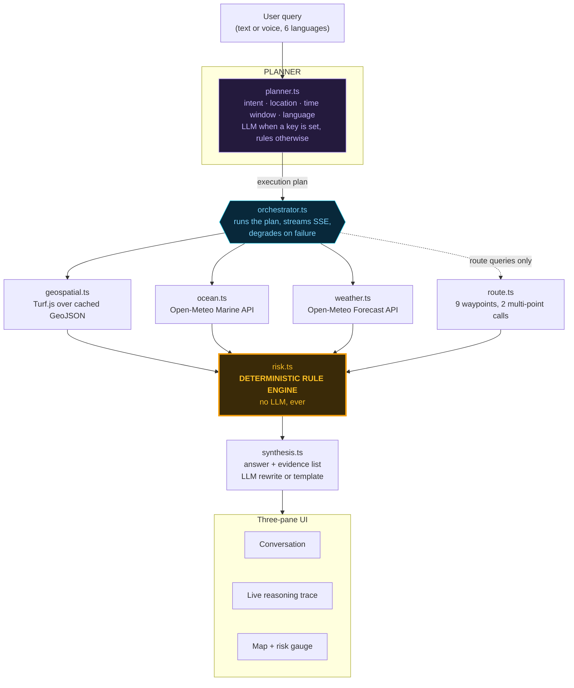

# ORCA architecture

## Agent mesh



The load-bearing property: **everything flows into `risk.ts`, and `risk.ts` contains no model
call.** The LLM sits on the two ends — understanding the question and phrasing the answer —
and never in the middle where the safety decision is made.

## Orchestration flow

1. **Plan.** `planner.ts` returns a `QueryPlan`: intent, resolved location, time window,
   language, and an ordered list of agents with a task string each. Streamed first, so the
   decomposition is visible *before* any agent runs.
2. **Geospatial.** Local Turf.js work against the bundled GeoJSON. Sub-millisecond, never fails.
3. **Ocean + weather in parallel.** Independent, so they run concurrently. `step_end` events
   are emitted in *completion* order via a keyed `Promise.race`, not in launch order — the
   trace shows whichever actually finished first.
4. **Route** (route queries only). Samples 9 waypoints, scores each with the same rule engine.
   Uses Open-Meteo's comma-separated multi-coordinate mode, so 9 waypoints cost 2 HTTP requests
   rather than 18.
5. **Risk.** Deterministic. Emits triggered rules, cleared checks, score, band, confidence.
6. **Map payload.** Centre, zoom, markers, active layers, route polyline, boundary warning.
7. **Synthesis.** Answer text plus the evidence list, each item tagged with the agent that
   produced it and that agent's provenance.

### Degradation

A failing agent never aborts the run:

| Failure | Behaviour |
|---|---|
| API times out or errors | Fall back to a cached snapshot of a real prior response, labelled `SNAPSHOT`, confidence −0.2 |
| No snapshot within 250 km | Agent reports failure, listed in `missing`, confidence −0.35 to −0.4 |
| Sea state **or** wind missing | Risk band becomes `UNKNOWN` — never a reassuring `SAFE` |
| LLM key absent or call fails | Rule-based planner and template synthesis; full functionality |
| Orchestrator throws | `error` event, then `done` — the stream always terminates cleanly |

### Streaming

`/api/query` returns Server-Sent Events. The orchestrator is an async generator; each yielded
event is flushed immediately. Measured on a warm server, the first event reaches the client in
**~12 ms**, long before the data agents finish.

`uiPaceMs` (default 220 ms) inserts a presentation-only delay *between events so a human can
follow the trace*. It delays display, never work — every card reports its own real measured
duration. Set it to `0` for benchmarking.

## Data provenance model

Every value carries a `Provenance` record and nothing renders without one.

| Kind | Meaning | Used for |
|---|---|---|
| `LIVE` | Fetched from an external API during this request | wave, swell, wave period, SST, wind, gusts, rain, visibility |
| `CACHED` | Shipped GeoJSON in `/data` | PFZ zones, IMBL, MPAs, coastline, EEZ, harbours |
| `ARCHIVE` | Real historical record, fetched live from the Open-Meteo archive | Cyclone Dana replay |
| `SNAPSHOT` | Verbatim capture of a real prior API response, used only after a live call failed | offline fallback |
| `DERIVED` | Computed by ORCA | risk score, planner output, synthesis |

Each record carries `fetchedAt`, so the age chip is computed, not asserted. An archive record
is stamped with the **event** date, which is why the cyclone replay shows "686 d old" rather
than pretending to be current.

## Prototype → production mapping

| Concern | This prototype | Production (the deck's stack) |
|---|---|---|
| Agent orchestration | TypeScript async generator in a Next.js route handler | **LangGraph** `StateGraph`, same nodes and edges |
| Backend | Next.js route handlers | **FastAPI** service |
| Spatial queries | Turf.js over bundled GeoJSON, in memory | **PostGIS + H3** indexing |
| PFZ source | ORCA demo derivation from an SST/chlorophyll proxy table | **INCOIS PFZ advisory feed** |
| Ocean + weather | Open-Meteo Marine + Forecast (free, keyless) | **INCOIS**, **MOSDAC**, **IMD** feeds; Open-Meteo as redundancy |
| Boundaries | Approximate IMBL turning points | Survey of India / Naval hydrographic office authoritative dataset |
| Protected areas | 5 simplified rectangles | WDPA / MoEFCC gazetted polygons |
| Caching | Process-local `Map` with 10 min TTL | **Redis**, same key shape |
| Translation / ASR / TTS | Locale JSON + browser Web Speech API | **Bhashini** ASR, TTS and translation |
| Alerts | Rendered notification preview | SMS gateway, IVR, push; NDMA/state integration |
| Client | Responsive web | **React Native** app + 24-hour offline bundle + SMS/IVR last mile |
| Risk engine | Deterministic rule engine | **Unchanged** — this is the part that should not become a model |

Each substitution is a swap at a module boundary, not a rewrite. `geospatial.ts` is the only
file that touches the spatial layers; `ocean.ts` and `weather.ts` are the only files that touch
upstream feeds; `synthesis.ts` and the locale files are the only places translation lives.

## What the prototype does not implement

Stated plainly because judges ask, and a team that names its stand-ins is more credible than
one that doesn't:

- No offline-at-sea bundle. The deck's answer is a 24-hour cached bundle plus SMS/IVR; the
  architecture already separates retrieval from reasoning so it drops in.
- No real SMS/IVR delivery. The alerts panel renders the exact payload, and sends nothing.
- No Bhashini. Language support is a compatible layer sitting at the same seam.
- No user accounts, vessel registry or trip logging.
- No PostGIS. Layer volumes here are small enough for in-memory Turf.js.

## File map

```
src/agents/      planner · geospatial · ocean · weather · route · risk · synthesis · orchestrator
src/lib/         types · layers · geo · net · cache · time · series · provenance · llm · i18n · lang · scenarios · snapshots
src/app/api/     query (SSE) · layers · alerts · reset
src/components/  Orca · ConversationPane · TracePane · MapPane · LeafletMap · RiskGauge · AlertsPanel · ProvenanceChip
src/locales/     en · hi · ta · bn · ml · te   (158 keys each, parity-checked)
data/            harbours · pfz-zones · imbl · mpa · coastline · eez · snapshots/
scripts/         generate-layers.mjs   (regenerates the derived layers)
```
