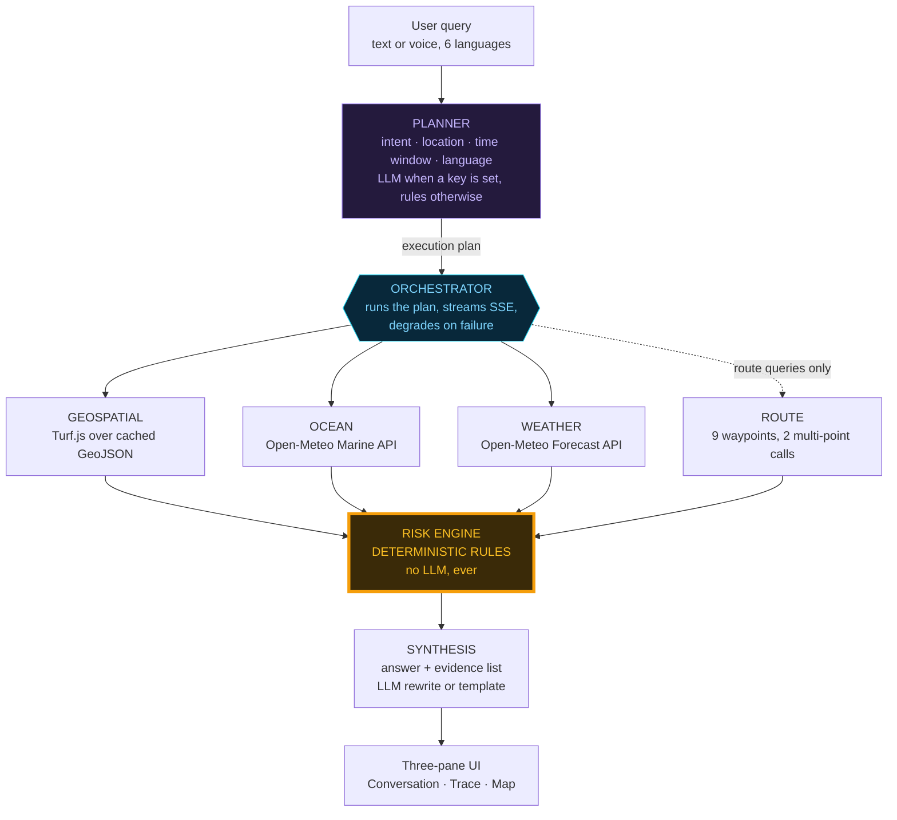

# ORCA

## Agentic AI Marine Intelligence Platform

**Smart India Hackathon 2026** · Problem Statement 26176 (ISRO) · Theme: Disaster Management
Team NextGen Coder · Team ID SIH-S-B1-212

Repository: https://github.com/Ankitrajofficial/marin-project

---

# 1. What ORCA is

Marine data for the Indian coast already exists. INCOIS publishes potential fishing zone
advisories and high-wave alerts. MOSDAC carries satellite ocean products. IMD issues cyclone
and fishermen warnings. Bhuvan holds the geospatial base.

A fisherman at Kasimedu at 4 a.m. can use none of it. The data is in bulletins, PDFs, portals
and English, and the decision he actually needs to make is one sentence long: *do I go out
today, and where.*

ORCA is a conversational platform that answers that question. Ask in natural language, in your
own language, and several specialised AI agents assemble an answer from live ocean and weather
data, geospatial layers and a deterministic hazard engine — with the reasoning visible on
screen while it happens.

**Target queries the prototype handles end to end:**

- Where is the nearest Potential Fishing Zone today?
- Is it safe to go to sea tomorrow morning from Kanyakumari?
- What are the tide, weather and sea conditions near my location?
- Any cyclone or lightning alerts in my area?
- What is the safest route from Chennai to Puducherry for a small fishing vessel?
- Am I close to any restricted or international boundary water?
- Why has fish productivity dropped near this coast?

---

# 2. Is the output based on real data?

This is the first question any evaluator asks, so it gets answered first and without hedging.

**Partly — and the application labels every single value with which it is.** That labelling is
the product, not a disclaimer. Nothing cached is ever presented as live.

## 2.1 Live, fetched at the moment you ask

Every one of these comes from a free, keyless public API at request time. The URL is printed
inside the trace pane, so an evaluator can paste it into a browser and check.

| Value | Source | Sample (Chennai, 10 Sep 2026) |
|---|---|---|
| Significant wave height | Open-Meteo Marine API | 0.76 m |
| Swell height | Open-Meteo Marine API | 0.72 m |
| Wave period | Open-Meteo Marine API | 8.95 s |
| Sea surface temperature | Open-Meteo Marine API | 30.74 °C |
| Sustained wind, gusts, direction | Open-Meteo Forecast API | 10.6 / 33.5 km/h |
| Rainfall, weather code, visibility | Open-Meteo Forecast API | 0.3 mm, light drizzle |

Both endpoints return 72 hourly steps with `timezone=Asia/Kolkata`, which is why a query about
"tomorrow morning" resolves against a genuine 06:00–12:00 IST window rather than a vague
average.

**Verification performed.** Querying the marine endpoint directly for the same coordinate
returned wave heights of 0.76–0.80 m and SST of 30.5–30.9 °C across the same period — the same
dataset ORCA reports from, at the same magnitudes.

## 2.2 Cached demo layers — labelled `CACHED` wherever they appear

| Layer | What it actually is |
|---|---|
| Potential Fishing Zones | An **ORCA derivation** from a static SST + chlorophyll-a proxy table. **Not INCOIS advisories.** The generating script ships in the repository |
| Maritime boundaries (IMBL) | Approximate turning points digitised from public descriptions of the 1974/1976 India–Sri Lanka agreements, ±2–5 km. **Not for navigation** |
| Marine protected areas | 5 simplified rectangles approximating real gazetted MPAs |
| Coastline / EEZ | Hand-digitised at roughly 50 km resolution; EEZ is the coastline offset 200 nm |
| Harbours | 20 real fishing harbours and landing centres with real coordinates |

## 2.3 Derived by ORCA

The risk score, band, triggered rules and the answer text. All computed from the values above.

## 2.4 The special case: the cyclone scenario is real data too

Today's Odisha coast is usually calm. A live query at Paradip returns SAFE, which would make a
"cyclone warning" scenario a lie.

So instead of inventing a storm, ORCA replays **real archived conditions from Cyclone Dana's
landfall (24–25 October 2024)**, fetched live at demo time from the Open-Meteo historical
archive (ERA5 reanalysis plus wave reanalysis):

| Measurement | Value |
|---|---|
| Significant wave height | 4.18 m |
| Swell height | 3.78 m |
| Sustained wind | 48.9 km/h |
| Wind gusts | 88.9 km/h |
| Rainfall over the window | 164.1 mm |
| Resulting assessment | **100 / 100 — UNSAFE**, 5 rules triggered |

This is genuine measured and reanalysed data from a genuine cyclone. It is labelled a
historical replay in the answer text, in the time-window field, and on the provenance chip —
which is stamped with the **event** date, so the age reads "686 d old" rather than pretending
to be current.

## 2.5 The provenance model

Five kinds, and every rendered value carries one:

| Kind | Meaning |
|---|---|
| `LIVE` | Fetched from an external API during this request |
| `CACHED` | Shipped GeoJSON in `/data` |
| `ARCHIVE` | Real historical record, fetched live from the Open-Meteo archive |
| `SNAPSHOT` | Verbatim capture of a real prior API response, used **only** after a live call failed |
| `DERIVED` | Computed by ORCA |

Each record carries a `fetchedAt` timestamp, so the displayed age is computed rather than
asserted.

**Audit performed.** An automated check across live and archive runs confirmed that no cached,
archive or snapshot value is ever emitted with kind `LIVE`, and that all 35 references to
INCOIS in the shipped code and data are either explicit negations, threshold citations, or
production-roadmap notes. No PFZ polygon is described anywhere as an INCOIS advisory.

---

# 3. Technology stack

## 3.1 Runtime and framework

| Component | Version | Why |
|---|---|---|
| Next.js (App Router) | 15.5.25 | One process for UI and API, native streaming, deploys to Vercel free tier |
| React | 19.1.1 | Required by react-leaflet 5 |
| TypeScript | 5.9.3 | `strict` mode, no `any` in agent contracts |
| Tailwind CSS | 4.3.3 | Zero-config v4 pipeline |
| Node.js | 24.x | Matches the Vercel build image |

## 3.2 Domain libraries

| Component | Version | Role |
|---|---|---|
| Turf.js | 7.4.0 | All geodesy: distance, point-in-polygon, nearest-point-on-line |
| Leaflet | 1.9.4 | Map rendering |
| react-leaflet | 5.0.0 | React bindings |
| CARTO dark basemap | — | Free, keyless tiles. **Mapbox was rejected because it requires a token** |
| Anthropic SDK | 0.65.0 | Optional. Planner and synthesis only |

## 3.3 Data sources

| Source | Access | Used for |
|---|---|---|
| Open-Meteo Marine API | Free, **no key** | Wave height, direction, period, swell, SST |
| Open-Meteo Forecast API | Free, **no key** | Wind, gusts, direction, rain, weather code, visibility |
| Open-Meteo Historical Archive | Free, **no key** | Cyclone Dana replay (ERA5) |
| Bundled GeoJSON | Local | PFZ, IMBL, MPA, coastline, EEZ, harbours |

## 3.4 Deliberately absent

**No database.** Layers are GeoJSON files; conversation state lives in React; response caching
is a process-local map with a 10-minute TTL.

**No Python backend.** Agents are TypeScript modules running inside route handlers.

**No API key required.** With no `ANTHROPIC_API_KEY` the planner uses a deterministic parser
and answers are composed from templates in all six languages. Everything works, including all
six demo scenarios.

**No geocoding service.** Locations resolve against the bundled 20-harbour gazetteer, explicit
coordinates, or a device fix.

## 3.5 Project size

| Metric | Count |
|---|---|
| TypeScript / TSX source | 4,837 lines |
| Agents | 8 files, 1,859 lines |
| Library modules | 13 |
| React components | 8 |
| API routes | 4 |
| Locale files | 6 × 158 keys, parity-enforced |
| Data payload | 96 KB total |

---

# 4. Architecture

## 4.1 The agent mesh



The load-bearing property of this diagram: **everything flows into the risk engine, and the
risk engine contains no model call.** The language model sits on the two ends — understanding
the question and phrasing the answer — and never in the middle where the safety decision is
made.

## 4.2 Execution flow

**Step 1 — Plan.** The planner returns intent, resolved location, time window, language, and
an ordered list of agents each with its own task description. This is streamed *first*, before
any agent runs, so the decomposition is visible before any data arrives.

**Step 2 — Geospatial.** Local Turf.js work against bundled GeoJSON. Sub-millisecond, cannot
fail, so it runs first and gives the trace something immediate.

**Step 3 — Ocean and weather, in parallel.** These are independent, so they run concurrently.
Their completion events are emitted in *finishing* order via a keyed `Promise.race`, not launch
order — the trace shows whichever genuinely returned first.

**Step 4 — Route** (route queries only). Samples 9 waypoints and scores each with the same rule
engine. Open-Meteo accepts comma-separated coordinate lists, so 9 waypoints cost **2 HTTP
requests, not 18**.

**Step 5 — Risk.** Deterministic. Emits score, band, triggered rules, cleared checks, confidence.

**Step 6 — Map payload.** Centre, zoom, markers, active layers, route polyline, boundary warning.

**Step 7 — Synthesis.** Answer text plus the evidence list, each item tagged with the agent that
produced it and that agent's provenance.

## 4.3 The seven agents

| Agent | Lines | Tool | Output |
|---|---|---|---|
| `planner` | 310 | Claude API *or* keyword + script rules | Intent, location, time window, language, execution plan |
| `geospatial` | 196 | Turf.js over 5 GeoJSON layers | Nearest PFZ, nearest harbour, boundary distance, MPA containment, EEZ |
| `ocean` | 159 | Open-Meteo Marine API | Wave height, direction, period, swell, SST |
| `weather` | 174 | Open-Meteo Forecast API | Wind, gusts, direction, rain, weather code, visibility |
| `route` | 192 | Open-Meteo multi-point + risk engine | Scored waypoints, polyline, forced detours |
| `risk` | 205 | **Pure function. No tool.** | Score, band, triggered rules, cleared checks, confidence |
| `synthesis` | 349 | Claude API *or* locale templates | Answer text, evidence list |

Each returns the same envelope: `{ agent, task, ok, degraded, data, error, confidencePenalty,
provenance[], toolCalls[], durationMs }`. Nothing downstream knows or cares whether an LLM was
involved.

## 4.4 Graceful degradation

A failing agent never aborts the run.

| Failure | Behaviour |
|---|---|
| API times out or errors | Fall back to a snapshot of a real prior response, labelled `SNAPSHOT`, confidence −0.2 |
| No snapshot within 250 km | Agent reports failure, listed in `missing`, confidence −0.35 to −0.4 |
| Sea state **or** wind missing | Band becomes `UNKNOWN` — never a reassuring `SAFE` |
| LLM key absent or call fails | Rule-based planner, template synthesis, full functionality |
| Orchestrator throws | `error` event then `done` — the stream always terminates cleanly |

The 250 km rule matters: answering a Kochi question with Chennai's sea state would be worse
than admitting the failure.

---

# 5. The deterministic risk engine

## 5.1 Why this is the most important design decision

`src/agents/risk.ts` is a pure function of measured values and published thresholds. The same
inputs always produce the same score, band and rule list.

**A language model never participates in hazard classification.** It plans the query and writes
the explanation. It never decides whether it is safe to go to sea.

This answers the hallucination objection *structurally* rather than rhetorically. The model
cannot invent a hazard value because it is never asked for one.

## 5.2 Scoring

Each triggered rule contributes points. The score is their sum, clamped 0–100.

| Score | Band | Meaning |
|---|---|---|
| 0–33 | `SAFE` | Conditions within normal operating limits |
| 34–66 | `CAUTION` | Sail only with caution and a working radio |
| 67–100 | `UNSAFE` | Do not venture to sea |
| n/a | `UNKNOWN` | Sea state or wind missing — **not a clearance** |

## 5.3 Why `UNKNOWN` exists

During hardening, a test knocked out both data agents. The engine returned **`0/100 SAFE`** —
"conditions look safe for a small fishing vessel", backed by no data whatsoever.

That is the most dangerous output this system could produce. A score of zero means *"no hazard
found in the data we have"*, which is not the same as *"it is safe"*.

The engine now refuses:

```
haveCore = ocean !== null && weather !== null
band = (!haveCore && score <= 66) ? UNKNOWN : ...normal bands
```

Missing data can never *downgrade* a hazard that was actually observed — an `UNSAFE`-weight
rule still escalates normally. Only the reassurance is withheld.

## 5.4 The 17 thresholds

Vessel class: **small mechanised / motorised fishing vessel under 20 m LOA** — the boat most
Indian marine fishers actually operate.

Values are the **worst hour** in the requested window, not the mean, because a vessel meets the
worst conditions of its trip.

### Sea state

| Rule | Condition | Points | Basis |
|---|---|---|---|
| `wave-danger` | wave height ≥ 2.5 m | 34 | INCOIS High Wave Alert band |
| `wave-caution` | wave height ≥ 1.5 m | 18 | Small-craft advisory band |
| `swell-danger` | swell ≥ 3.0 m | 20 | Surge alert band |
| `swell-caution` | swell ≥ 2.0 m | 10 | Breaks dangerously at harbour bars |
| `steep-sea` | period < 6 s **and** height > 2 m | 10 | Short steep seas capsize small craft |

### Wind and weather

| Rule | Condition | Points | Basis |
|---|---|---|---|
| `wind-danger` | sustained ≥ 45 km/h | 28 | IMD fishermen warning territory |
| `wind-caution` | sustained ≥ 25 km/h | 12 | Beaufort 4–5, choppy |
| `gust-danger` | gusts ≥ 55 km/h | 22 | Squall strength. Gusts knock boats down, not sustained wind |
| `gust-caution` | gusts ≥ 40 km/h | 8 | Squall development |
| `precip-danger` | rain ≥ 35 mm in window | 14 | IMD heavy rain band |
| `precip-caution` | rain ≥ 10 mm in window | 6 | Visibility degradation begins |
| `thunderstorm` | WMO code ≥ 95 | 20 | An open boat is the tallest object for miles |
| `visibility` | visibility < 2000 m | 12 | Collision risk |

### Restricted waters

| Rule | Condition | Points | Basis |
|---|---|---|---|
| `imbl-critical` | ≤ 2 nm from a boundary | 40 | Imminent crossing; detention is a documented recurring harm |
| `imbl-warning` | ≤ 5 nm | 22 | Advisory buffer with sea room to turn |
| `imbl-advisory` | ≤ 10 nm | 8 | Awareness buffer |
| `mpa-inside` | inside a no-fishing MPA core | 30 | Statutory prohibition |

## 5.5 Confidence is not risk

Two separate numbers, both shown:

- **Risk score** — how dangerous the measured conditions are
- **Confidence** — how much of the picture we obtained

```
confidence = clamp(dataCompleteness − Σ upstream penalties, 0.1, 1.0)
```

A high-confidence SAFE and a low-confidence SAFE mean different things, so they never collapse
into one number.

## 5.6 Cleared checks

The gauge lists every rule that was evaluated **and passed**, with measured value beside
threshold. This proves the engine checked the whole table rather than only reporting what it
chose to.

## 5.7 Honest note on threshold provenance

These thresholds encode operational practice for Indian coastal waters: INCOIS high-wave bands,
IMD fishermen-warning speeds, Beaufort small-craft conventions, MHA/Coast Guard buffers. They
are the right shape and the right order of magnitude.

They are **not transcribed from a specific gazetted bulletin.** Before operational deployment
each row must be pinned to the exact current INCOIS/IMD definition and reviewed with the
relevant state fisheries department. This is why the engine emits its version string
(`orca-deterministic-rules-v1`) with every assessment.

---

# 6. Data layers in detail

## 6.1 The PFZ derivation

The fishing zones are computed, not drawn. `scripts/generate-layers.mjs` runs:

```
front        = normalise(sst_gradient,   0.15 … 0.65)
productivity = normalise(chlorophyll_a,  0.60 … 2.80)
score        = 0.45 · front + 0.55 · productivity
emit zones scoring ≥ 0.35
```

This is the *shape* of INCOIS PFZ logic — thermal fronts plus primary productivity — at toy
fidelity. The script ships in the repository so the derivation is inspectable and reproducible.

Output: **14 zones** along both coasts, each carrying its score, confidence band, SST,
chlorophyll value, depth band, and the label *"Demo derivation — production consumes the INCOIS
PFZ advisory feed."*

**A tuning note worth telling.** The first run emitted only 5 zones, all on the Kerala–Gujarat
upwelling belt, leaving the entire east coast — including Chennai — empty. East coast
chlorophyll values were raised to reflect real Ganga/Mahanadi/Godavari plume enrichment and the
threshold lowered to 0.35, giving 14 zones with sensible coverage. Rameswaram still emits none,
which is **correct**: Palk Bay is not a productive fishing front, and it makes the geofence
scenario's story land properly.

## 6.2 Boundaries

Three segments: India–Sri Lanka Palk Bay (1974 agreement), India–Sri Lanka Gulf of Mannar
(1976 extension), and an indicative line in the Sir Creek sector — which is labelled
**disputed**, because no delimitation agreement is in force there.

Geofence buffers: 2 nm critical, 5 nm warning, 10 nm advisory.

Every popup and every answer mentioning a boundary repeats that these positions are approximate
and must not be used for navigation.

## 6.3 Protected areas

Five simplified polygons: Gulf of Mannar Marine National Park, Gulf of Kachchh Marine National
Park, Malvan Marine Sanctuary, Mahatma Gandhi Marine National Park (Wandoor), and Gahirmatha
Marine Sanctuary — the last carrying its seasonal Olive Ridley nesting closure.

## 6.4 Harbours

20 real fishing harbours and landing centres across Gujarat, Maharashtra, Karnataka, Kerala,
Tamil Nadu, Puducherry, Andhra Pradesh, Odisha, West Bengal and the Andamans, each with
aliases so that "Vizag", "Cochin" or "Madras" resolve correctly.

## 6.5 Offline snapshots

Seven verbatim captures of real Open-Meteo responses. They exist for exactly one reason: a
venue network that dies mid-demo.

Rules enforced in code:

1. A snapshot is used only *after* a live call has actually failed
2. It is always surfaced as `SNAPSHOT` with its capture time
3. A snapshot more than 250 km from the query point is **refused**
4. The Cyclone Dana archive is never auto-substituted for live conditions

---

# 7. The user interface

Three panes, desktop-first because evaluators watch on a projector, usable on a phone.

## 7.1 Left — Conversation

Chat with a text box, six suggested-question chips, a language selector, and a microphone
button using the browser Web Speech API. Six demo scenarios sit above as one-click buttons.
Answers carry a read-aloud control and a provenance chip row.

## 7.2 Centre — Live Reasoning Trace

**This is the differentiator and it gets the most space.**

As the orchestrator runs, each step streams in as a card showing: which agent, what it was
asked, which tool or API it called, what came back, how long it took, and a status indicator.

The planner's decomposition appears **first**, before any agent runs — the moment an evaluator
understands this is not a chatbot.

Every tool call expands to reveal the **raw JSON from the real API**. An evaluator who clicks
in finds a genuine payload, not a mock. The pane ends with a confidence badge and the full
evidence list, each fact tagged with its producing agent and provenance chip.

## 7.3 Right — Map and risk gauge

Leaflet on a free CARTO dark basemap. Renders query location, PFZ polygons, IMBL lines with a
proximity banner, protected areas, harbours, and the scored route polyline. Layer toggles and a
legend. Every polygon popup states what the layer is and how honest it is about itself.

Below the map, the risk gauge shows the score arc, the band, and each triggered rule with the
**actual measured value beside its threshold** — "wave height 4.18 m vs ≥ 2.5 m" rather than a
bare number — plus every check that cleared, and the engine attribution line.

## 7.4 Alerts panel

For a saved location, evaluates current conditions and renders the notification exactly as
production would deliver it: a 160-character SMS body, an IVR script, and a push payload.
**No SMS provider is integrated.** It is a faithful preview, not a send.

---

# 8. Multilingual layer

Six languages: **English, Hindi, Tamil, Bengali, Malayalam, Telugu.**

Query language is auto-detected by Unicode script range — for these six the writing systems do
not overlap, so the check is exact and needs no dependency. An explicit UI selection always
wins over detection.

**What is localised:** UI strings, verdicts, sea-state and wind sentences, hazard rule names,
WMO weather conditions, time-window labels, boundary warnings, and the productivity explanation.
158 keys per locale, machine-checked for parity.

**What stays in English, deliberately:** harbour proper nouns, upstream source names, the engine
version string, and SI units.

Rule names were localised late in the build, after a Tamil test answer came back roughly 90%
Tamil with English rule labels sitting in the most important sentence. An evaluator who reads
Tamil would have seen exactly that.

Voice input and read-aloud use the browser Web Speech API — free, no service, no key.

This is a **Bhashini-compatible layer**. Bhashini is *not* integrated. Production swaps it in at
the same seam.

---

# 9. Streaming and performance

`/api/query` returns Server-Sent Events. The orchestrator is an async generator; each yielded
event is flushed immediately.

| Measurement | Result |
|---|---|
| First event reaches client (warm) | **12 ms** |
| Full scenario, warm | ~2.0 s |
| Cold start: page compile + load | 2.3 s |
| Cold start: first full scenario | 4.9 s |
| Six concurrent runs | all completed, 1.0 s |

A `uiPaceMs` value (default 220 ms) inserts a presentation-only delay between events so a human
can follow the trace. **It delays display, never work** — every card reports its own real
measured duration. Set it to 0 for benchmarking.

Response caching is a process-local map with a 10-minute TTL. On serverless hosting each
invocation may get a fresh instance, so hit rates are lower there; this is precisely the seam
where production swaps in Redis.

---

# 10. What was tested

Verification was done by running the real pipeline end to end, not by unit tests.

| Test | Result |
|---|---|
| `tsc --noEmit` strict | Clean |
| `tsc` with `--noUnusedLocals --noUnusedParameters` | Clean |
| `next build` | Clean |
| All 6 scenarios, production build, zero env vars | Pass |
| Clean clone + `npm ci` + build | Pass |
| Network kill mid-query | Falls back to labelled snapshot |
| No snapshot in range | `UNKNOWN` band, states missing agents |
| Inland location (Nagpur) | Ocean agent fails cleanly, `UNKNOWN`, explains why |
| Unknown location | Falls back to default with an explicit notice |
| Nonsense query | `unknown` intent, explains capabilities |
| 6 concurrent runs | All complete, no interleaving |
| Forced 1 ms timeout | Timeouts fire, degrade cleanly |
| Empty / overlong query | HTTP 400 |
| No `ANTHROPIC_API_KEY` | Full functionality, all languages |
| Provenance honesty audit | No cached value ever emitted as `LIVE` |

## 10.1 Bugs found and fixed during hardening

| Issue | Severity | Fix |
|---|---|---|
| Engine returned `0/100 SAFE` with both data agents dead | **Critical** | Added `UNKNOWN` band |
| Evidence cited wrong source (`"marine"` matched "marine protected area") | High | Per-agent provenance tracking |
| Cyclone scenario would have shown SAFE | High | Real Cyclone Dana archive replay |
| "sail from Chennai" misread as a route query | Medium | Narrowed keywords; two resolved harbours imply a passage |
| Tamil answers ended in English rule names | Medium | Localised rules, WMO codes, time windows |
| First PFZ run left the entire east coast empty | Medium | Retuned derivation, 5 → 14 zones |
| Next.js 15.5.4 under a security advisory (CVE-2025-66478) | High | Upgraded to 15.5.25 |

---

# 11. Prototype to production

| Concern | This prototype | Production |
|---|---|---|
| Orchestration | TypeScript async generator | **LangGraph** `StateGraph`, same nodes and edges |
| Backend | Next.js route handlers | **FastAPI** |
| Spatial queries | Turf.js in memory | **PostGIS + H3** |
| PFZ source | ORCA demo derivation | **INCOIS PFZ advisory feed** |
| Ocean and weather | Open-Meteo | **INCOIS, MOSDAC, IMD**; Open-Meteo as redundancy |
| Boundaries | Approximate turning points | Survey of India / Naval hydrographic dataset |
| Protected areas | 5 rectangles | WDPA / MoEFCC gazetted polygons |
| Caching | Process-local map | **Redis**, same key shape |
| Language | Locale JSON + Web Speech | **Bhashini** ASR, TTS, translation |
| Alerts | Rendered preview | SMS gateway, IVR, push, NDMA integration |
| Client | Responsive web | **React Native** + 24-hour offline bundle |
| Risk engine | Deterministic rules | **Unchanged** — this is the part that must not become a model |

Each substitution is a swap at a module boundary. `geospatial.ts` is the only file touching
spatial layers. `ocean.ts` and `weather.ts` are the only files touching upstream feeds.
`synthesis.ts` and the locale files are the only places translation lives.

## 11.1 Not implemented, stated plainly

- No offline-at-sea bundle. The architecture already separates retrieval from reasoning so it
  drops in
- No real SMS or IVR delivery. The payload is rendered; nothing is sent
- No Bhashini
- No PostGIS, no LangGraph
- No user accounts, vessel registry or trip logging

A team that names its stand-ins is more credible than one that does not.

---

# 12. Demo scenarios and measured results

All six run the real pipeline against live APIs, with labelled snapshot fallback.

| # | Scenario | Location | Measured result |
|---|---|---|---|
| 1 | Safe fishing day | Kanyakumari | 34/100 CAUTION — wind-caution, gust-danger |
| 2 | Cyclone warning (Dana replay) | Paradip, Odisha | **100/100 UNSAFE** — 5 rules |
| 3 | Nearest PFZ | Chennai | 0/100 SAFE — zone 60.8 km S |
| 4 | Geofence proximity | Off Rameswaram | 42/100 CAUTION — **2.23 nm** from the IMBL |
| 5 | Safe route | Chennai → Puducherry | 9 scored waypoints, 2 HTTP calls |
| 6 | Productivity decline | Off Kochi | SST + chlorophyll explanation |

---

# 13. Running it

```bash
git clone https://github.com/Ankitrajofficial/marin-project.git
cd marin-project
npm install
npm run dev          # http://localhost:3000
```

**No environment variables are required.**

Optional, for more fluent prose and better handling of off-script questions:

```bash
echo "ANTHROPIC_API_KEY=sk-ant-..." > .env.local
```

The key changes how the query is parsed and how the answer is phrased. It never changes the
safety verdict.

**Hidden demo reset:** `Ctrl`/`Cmd` + `Shift` + `K` clears conversation, trace, map and server
cache instantly with no page reload — for restarting between judging panels.

## 13.1 Repository contents

```
src/agents/      planner · geospatial · ocean · weather · route · risk
                 synthesis · orchestrator
src/lib/         types · layers · geo · net · cache · time · series
                 provenance · llm · i18n · lang · scenarios · snapshots
src/app/api/     query (SSE) · layers · alerts · reset
src/components/  Orca · ConversationPane · TracePane · MapPane
                 LeafletMap · RiskGauge · AlertsPanel · ProvenanceChip
src/locales/     en · hi · ta · bn · ml · te
data/            harbours · pfz-zones · imbl · mpa · coastline · eez
                 snapshots/
scripts/         generate-layers.mjs
```

Accompanying documents: `README.md`, `ARCHITECTURE.md`, `RISK-RULES.md`, `DECISIONS.md`.

---

# 14. Anticipated questions

**"Is this data real?"**
Wave, swell, wind and sea surface temperature are live and keyless — expand any trace card and
you will see the actual API response, and the URL is right there to check. PFZ polygons and
boundaries are cached demo layers, labelled as such on screen. Production consumes the INCOIS
advisory feed.

**"What if the LLM hallucinates a hazard value?"**
It cannot. It never touches the risk computation. The engine is a pure function of measured
values and documented thresholds, and it emits its version string with every assessment.

**"How is this different from an LLM with retrieval?"**
Open the trace pane. Separate agents with separate tool calls, a planner that decomposes the
query before anything runs, and an orchestrator that degrades gracefully when one agent fails.

**"What happens offline at sea?"**
The prototype does not implement it. The answer is a 24-hour offline bundle plus SMS and IVR,
and the architecture already separates retrieval from reasoning so it drops in.

**"Why should I trust the safety verdict?"**
Because you can audit it. Every triggered rule shows its measured value, its threshold and its
basis. Every cleared check is listed too, so you can see the engine evaluated the whole table.
And when data is missing it says `UNKNOWN` rather than `SAFE`.

---

# 15. Safety notice

ORCA is a hackathon prototype. It is **not** a navigational aid and must not be used to make
real decisions at sea.

Boundary positions are approximate. Fishing zones are a demo derivation, not an INCOIS advisory.
Always follow official INCOIS, IMD and Indian Coast Guard advisories.
